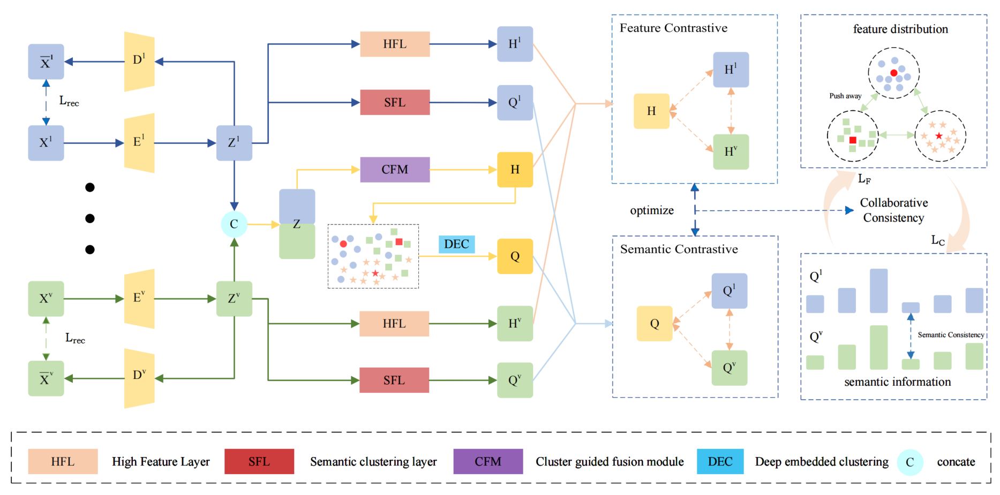
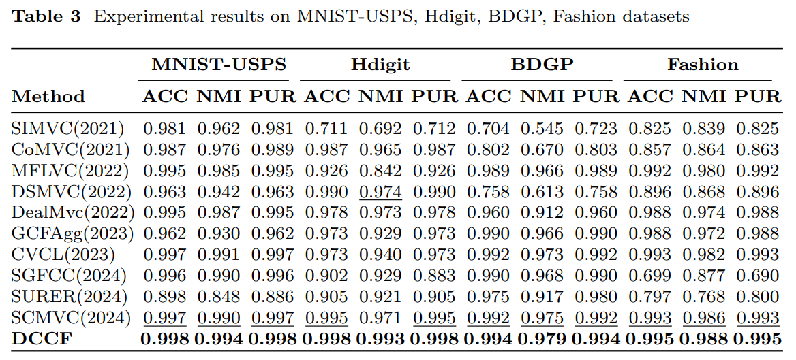
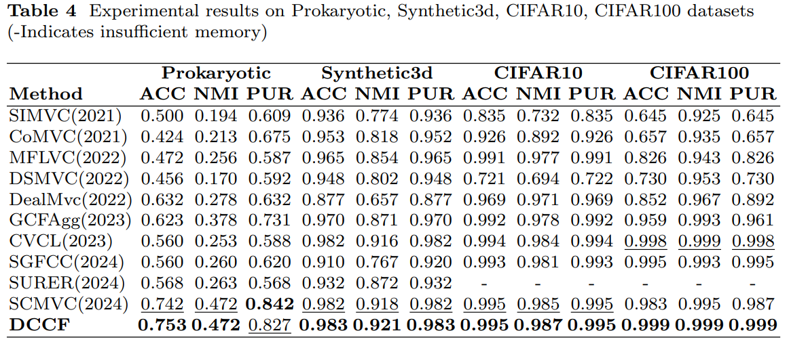
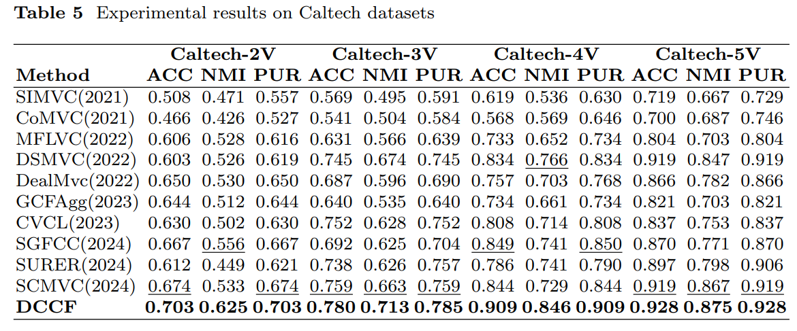

# DCCF
Shudong Hou, Le Zhao, Yongchi Fan, Chengxiao Peng, Zhehui Yu, Deep Multi-View Clustering via Dual Contrastive Consistency Fusion. (PyTorch Code).

## Abstract
Deep multi-view clustering(DMVC), with its ability to effectively mine cross-view feature representations, has garnered significant attention in recent years. At present, many deep learning-based multi-view clustering methods have been proposed and have achieved good clustering performance. However, most of the existing methods fail to fully utilize the semantic information of samples and are susceptible to the influence of view-private information, making it difficult to learn discriminative representations with clear clustering structures, thereby limiting the improvement of clustering performance. To address the aforementioned issues, this paper proposes a novel Deep Multi-View Clustering via Dual Contrastive Consistency Fusion (DCCF). Firstly, to obtain fusion features with a clear clustering structure,  a clustering-guided fusion module was designed that leverages consistency information in the semantic space as a self-supervised signal, enabling samples with similar semantics to be close to each other in the feature space. Subsequently, through dual contrastive learning, the consensus representation and view-specific representations are aligned. Eventually, the feature fusion process is fine-tuned using the optimized global semantic information of the sample to mitigate the impact of view imbalance. Extensive experiments on nine public datasets demonstrate that DCCF outperforms state-of-the-art methods in clustering performance.

## Framework

The framework of DCCF. We use independent MLP for feature extraction of each view. Then, the latent feature are concatenated and fed into fusion module to obtain the fused feature H. Concurrently, high-level features $H^v$ and semantic features $Q^v$ are learned for each individual view. We then employ a dual contrastive learning strategy to capture cross-view consistency information while dynamically guiding the multi-view feature fusion process using the learned semantic representations, thereby obtaining a more discriminative clustering structure.

## Comparison with the State-of-the-Art

TABLE IV: Experimental results on MNIST-USPS, Hdigit, BDGP, Fashion datasets.

TABLE IV: Experimental results on Prokaryotic, Synthetic3d, CIFAR10, CIFAR100 datasets(-Indicates insufficient memory).

TABLE V: Experimental results on Caltech datasets.

## Datasets
The used datasets could be downloaded from baidu  (链接: https://pan.baidu.com/s/1wS88ZsinLUYgocVbEZp0fg 提取码: kt19 ).
